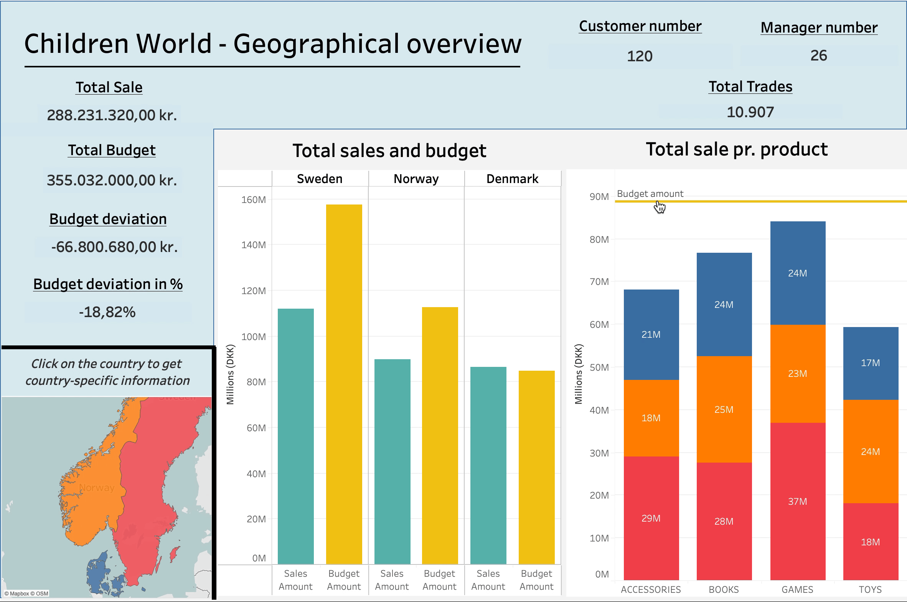
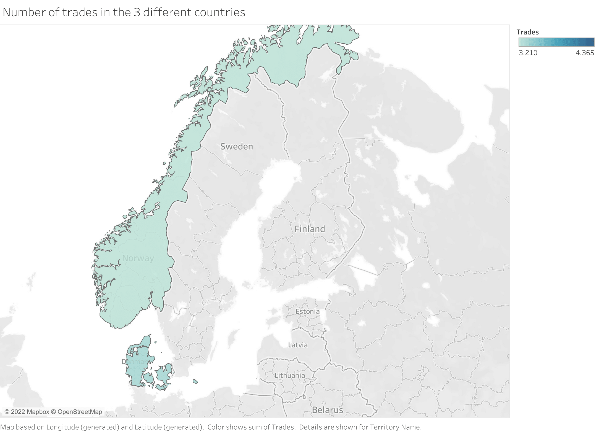
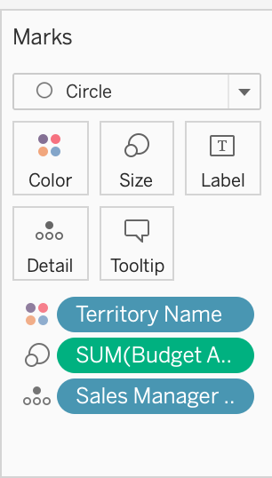
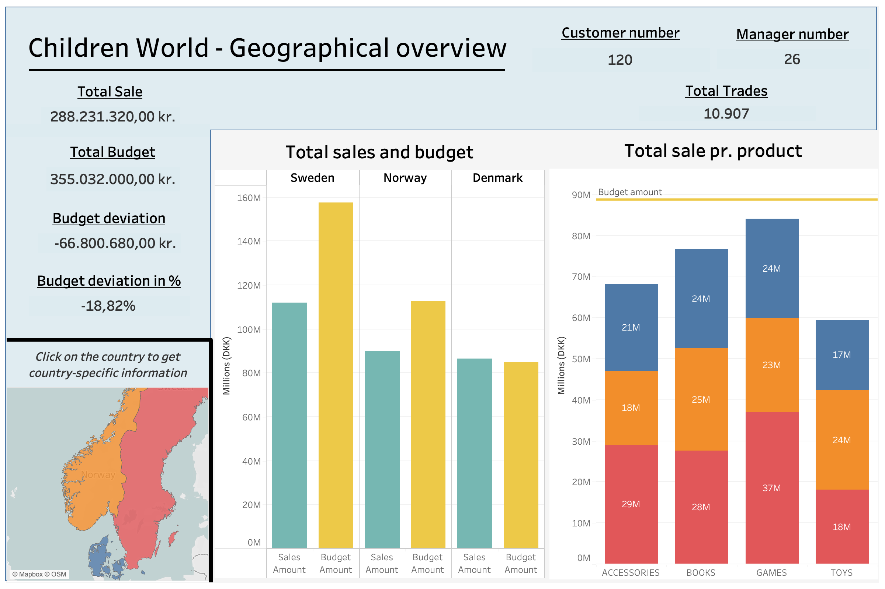
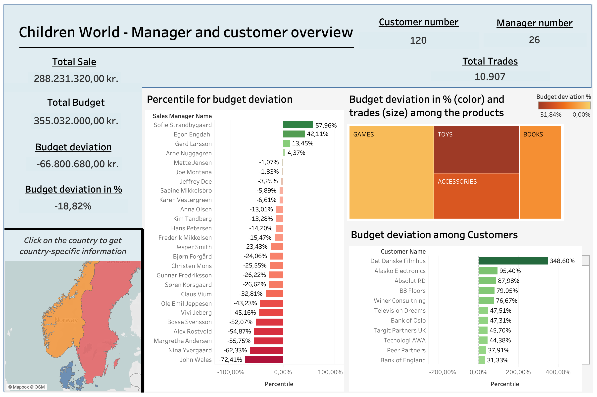
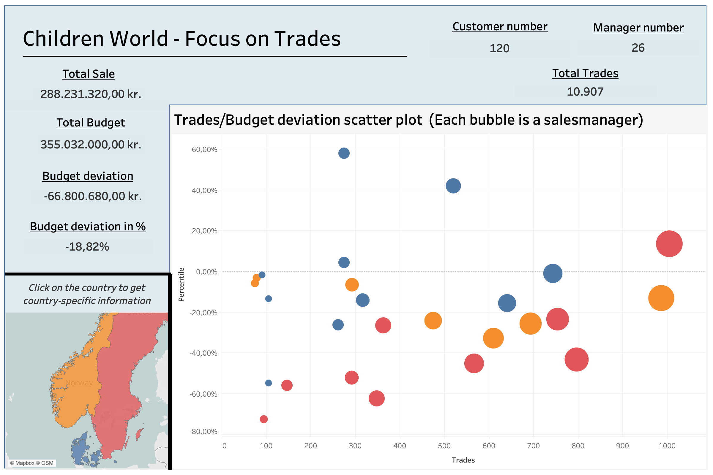

`Python`, `Pandas`, `Tableau`, `Dashboard`, `Interactive`, `Big Data`, `Data Cleaning`, `Data Visualizations`, `Basic Statistics`, `Business Intelligence`

# About Children World - Dashboard
The project is based on a dataset of an American company that specializes in production sale of children's products to businesses 
provided by Technical University of Denmark. This is a knowledge based project to learn a Business Intelligence (BI) tool as Tableau. 

<br>
<p align="center">  </p>
<br>


## Problems with the geographical values

In Tableau 6 different datatypes are accepted. These are:
- Text(String) values 
- Date values
- Date & Time values
- Numerical values
- Boolean values
- Geographical values

However this is so, we experience a problem with the geographical data type in the beginning. If we look at the raw data `data.xlsx`, we will see 
the abbreviations we get for the feature *TerritoryName* are `DK`, `SE` and `NO`, which respectively represent Denmark, Sweden and Norway. Although
this is the case, we see in the following image that Tableau doesn't recognize Sweden:

<br>
<p align="center">  </p>
<br>

This lead me to do some basic data wrangling with Python using the Pandas library:

<br>

<details>
<summary>Click to see the libraries</summary>

```python
# Import relevant library
import pandas as pd

# Load the raw data
df = pd.read_excel('data.xlsx')

# Correcting from abbreviation to full country name. To make tableau understand it.
df.loc[df['TerritoryName'] == "SE", 'TerritoryName'] = "Sweden"
df.loc[df['TerritoryName'] == "DK", 'TerritoryName'] = "Denmark"
df.loc[df['TerritoryName'] == "NO", 'TerritoryName'] = "Norway"

# Outputing the corrected dataframe as excel file
df.to_excel("cleaned_data.xlsx")  
```

</details>

<br>

## Steps against interactive dashboards

When the data finally is prepared and fulfill all the accepted datatypes listed above, we are ready to go. We first create worksheets, which contains a single view. Some of them are too easy to create, as it is drag and drop. But some worksheets requires additional so called `Calculated field` to illustrate the desired graphs, and others requires additionaly drag and drop operations to decorate it further. 

An example on calculated field is for instance the following code, which is used in many visuals for this project. 

```
# Deviation_budget_percentage
[Budget Deviation]/[Budget Amount]
```

An example on an illustration where additional drag and drops are applied, is for instance the scatter plot (last image at the very bottom of this readme file). The mark bar looks like the following image:

<br>
<p align="center">  </p>
<br>

By draging the `Territory Name` feature into color, which has the data type *Text(String)*, the circles turns into colorcode of their respective country. By this functionalty the colors (Red, Blue and Orange) remains the same throughout all the three dashboards, for respectively (Sweden, Denmark and Norway). Another feature which is dragged is SUM of the `Budget Amount` (Datatype is numerical values) into the size, which makes the sizes of the circles big with respect to the budget amount each sales manager has.  


## Dashboards for the Children World dataset

The next three illustration shows the static form of our interactive dashboards. To see actions please scrool up.


### 1.) Geographical overview

<br>
<p align="center">  </p>
<br>

### 2.) An overview of salesmanagers and customers

<br>
<p align="center">  </p>
<br>


### 3.) Focus on the trades 

<br>
<p align="center">  </p>
<br>


