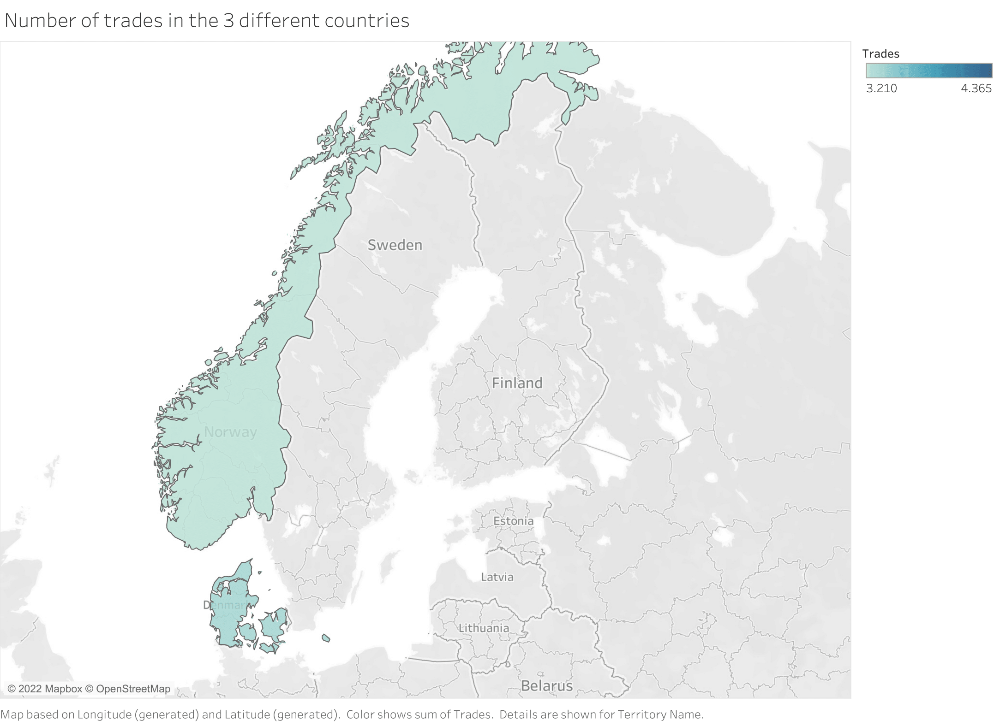

`Python`, `Pandas`, `Tableau`, `Dashboard`, `Interactive`, `Big Data`, `Data Cleaning`, `Data Visualizations`, `Basic Statistics`, `Business Intelligence`

# About Children World - Dashboard
The project is based on a dataset of an American company that specializes in production sale of children's products to businesses 
provided by Technical University of Denmark. This is a knowledge based project to master a Business Intelligence tool as Tableau. 


## Problems with the geographical values

In Tableau 6 different datatypes are accepted. These are:
- Text(String) values 
- Date values
- Date & Time values
- Numerical values
- Boolean values
- Geographical values

However this is so, we experience a problem with the geographical data type in the beginning. If we look at the raw data `data.xlsx`, we will see 
the abbreviations we get for the feature *TerritoryName* are `DK`, `SE` and `NO`, which respectively represent Denmark, Sweden and Norway. Although
this is the case, we see in the following image that Tableau doesn't recognize Sweden:

<br>
<p align="center">  </p>
<br>

This lead me to do some basic data wrangling with Python using the Pandas library:

###  Correcting the abbreviations

```python
# Import relevant library
import pandas as pd

# Load the raw data
df = pd.read_excel('data.xlsx')

# Correcting from abbreviation to full country name. To make tableau understand it.
df.loc[df['TerritoryName'] == "SE", 'TerritoryName'] = "Sweden"
df.loc[df['TerritoryName'] == "DK", 'TerritoryName'] = "Denmark"
df.loc[df['TerritoryName'] == "NO", 'TerritoryName'] = "Norway"

# Outputing the corrected dataframe as excel file
df.to_excel("cleaned_data.xlsx")  
```


